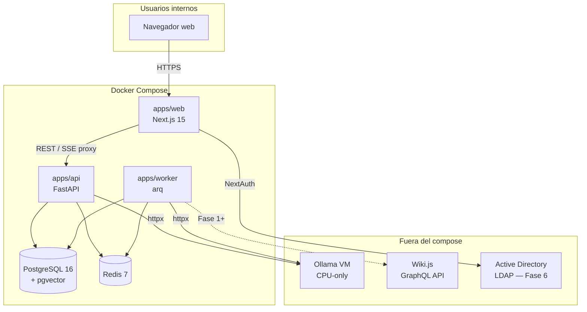
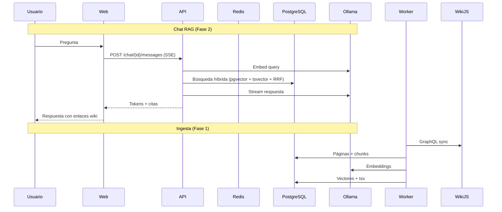

# WikiBridge — Arquitectura

> **Producto:** WikiBridge (nombre elegido en Fase 0)  
> **Organización:** CCMGC — Equipo de Sistemas  
> **Restricción principal:** 100% on-premise, inferencia vía Ollama en VM CPU-only

## Alternativas de nombre consideradas

| Nombre | Enfoque | Por qué se descartó / eligió |
|--------|---------|------------------------------|
| **WikiBridge** ✅ | Puente entre wiki estática y operaciones | Equilibra los tres pilares (RAG, salud, runbooks) sin sesgar hacia uno |
| DocMind CCMGC | IA + documentación | Genérico; suena a producto externo |
| Runbookia | Runbooks | Ignora chat y salud documental |
| NexusDoc | Hub documental | Demasiado abstracto para el equipo técnico |

## Visión

WikiBridge transforma la documentación de Wiki.js de un repositorio pasivo en conocimiento accionable:

1. **Chat RAG** — respuestas fundamentadas con citas a páginas wiki
2. **Salud documental** — detectores de obsolescencia, enlaces rotos, contradicciones
3. **Runbooks** — procedimientos como checklists ejecutables con trazabilidad

## Diagrama de arquitectura (Fase 0)

## Flujo de datos por módulo (planificado)

## Decisiones de diseño

### Monorepo

Un solo repositorio con `apps/` (servicios desplegables) y `packages/` (contratos compartidos). El cliente TypeScript se generará desde el OpenAPI de FastAPI en `packages/shared`.

### PostgreSQL + pgvector (única base de datos)

- Datos relacionales, vectores y full-text en un solo motor
- Backup y operación simplificados frente a ChromaDB u otra vector DB
- Búsqueda híbrida obligatoria: semántica (HNSW) + léxica (`tsvector` config `spanish`) fusionadas con RRF

### Ollama fuera del compose

Ollama corre en su propia VM (posiblemente compartida). La app se conecta por `OLLAMA_BASE_URL`. Esto permite escalar o cambiar hardware (GPU futura) sin redeployar la aplicación.

### Sin LangChain / LlamaIndex

Llamadas directas a Ollama con `httpx` y lógica propia de chunking/RAG. Menos magia, más depurable en un entorno de operaciones.

### Cola de trabajos: arq + Redis

Ingesta, análisis de obsolescencia y tareas pesadas **nunca** en el ciclo request/response. El worker comparte el paquete Python de `apps/api`.

### Autenticación

- **Producción:** NextAuth + LDAP/Active Directory
- **Desarrollo:** `AUTH_MODE=local` con proveedor de credenciales
- Roles: `admin`, `editor`, `lector` — verificados en backend (Fase 2+)

### Modelos por defecto (CPU-only)

| Uso | Modelo | Alternativa |
|-----|--------|-------------|
| Chat | `qwen2.5:7b-instruct` | `llama3.1:8b` |
| Embeddings | `bge-m3` | `nomic-embed-text` (trade-off: peor español) |

Todos configurables por variables de entorno sin cambiar código.

### Streaming SSE obligatorio

La latencia en CPU es alta; todas las respuestas del LLM se transmiten por SSE para feedback inmediato.

### Identidad visual

Tokens CSS centralizados en `apps/web/src/styles/tokens.css`:
- Base `#0a0f1e`, acento `#FFEB66`
- Superficies glass con elevación `--surface-0..3`
- Contraste AA, navegación por teclado en runbooks (Fase 5)

## Modelo de datos (resumen)

Ver prompt maestro para el esquema completo. Migración inicial `001_initial_ingest` con tablas `wiki_pages`, `chunks`, `ingest_jobs`, índices HNSW y `tsvector` en español.

## Seguridad

- Red interna asumida, pero **auth obligatoria** en todas las rutas
- API keys (Wiki.js) solo en variables de entorno del servidor
- Logs estructurados JSON en API y worker

## Fase B — Drift contra infraestructura (solo diseño)

Documentado en `fase-b-drift.md` (Fase 6). Interfaz `InfraProvider` para conectores read-only: LDAP/AD, DNS, GLPI.

## Estado actual: Fase 6

| Componente | Estado |
|------------|--------|
| Monorepo + compose | ✅ |
| FastAPI health (DB, Redis, Ollama) | ✅ |
| Worker arq (ingesta + cron + health scan) | ✅ |
| Next.js layout + tokens | ✅ |
| NextAuth modo local + LDAP | ✅ |
| Migraciones de datos | ✅ |
| Ingesta Wiki.js | ✅ |
| Panel admin ingesta | ✅ |
| Chat RAG (búsqueda híbrida + SSE + citas) | ✅ |
| Salud documental (detectores + triaje) | ✅ |
| Runbooks (generación + editor + sesiones) | ✅ |
| Diseño Fase B drift (`docs/fase-b-drift.md`) | ✅ |
